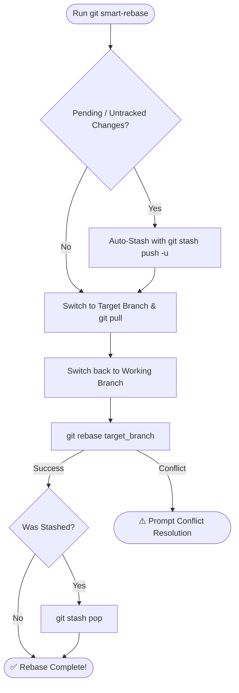

# ⚡ git-smart-rebase

A safe Git workflow utility that updates a target branch directly from remote, rebases your current branch onto it, and automatically preserves unstaged and untracked changes with `git stash`.

---

## 📋 What It Does Behind the Scenes



1. **Auto-Stashes Changes**: Stages modified and untracked files (`git add -A`) and safely stashes them.
2. **Updates Target Branch**: Checks out the target branch (default `develop`, or `main`, etc.) and pulls latest changes from `origin`.
3. **Switches Back & Rebases**: Returns to your original feature branch and rebases onto the updated target.
4. **Restores Workspace**: Restores your stashed changes automatically upon success.

---

## 📖 Usage Examples

```bash
# Rebase onto default target branch ('develop')
git smart-rebase

# Rebase onto 'main'
git smart-rebase main

# Rebase onto a specific branch using flags
git smart-rebase -b staging
git smart-rebase --branch=release/v1.0.0
git smart-rebase branch=master

# View help
git smart-rebase -h
```

---

## ⚡ Handling Conflicts

If Git encounters conflicts during the rebase step:

1. Resolve conflict markers (`<<<<<<<`, `=======`, `>>>>>>>`) in your editor.
2. Stage the resolved files:
   ```bash
   git add <resolved-files>
   ```
3. Continue the rebase:
   ```bash
   git rebase --continue
   ```
   *(Or abort: `git rebase --abort`)*
4. Once finished, restore your stashed work:
   ```bash
   git stash pop
   ```
